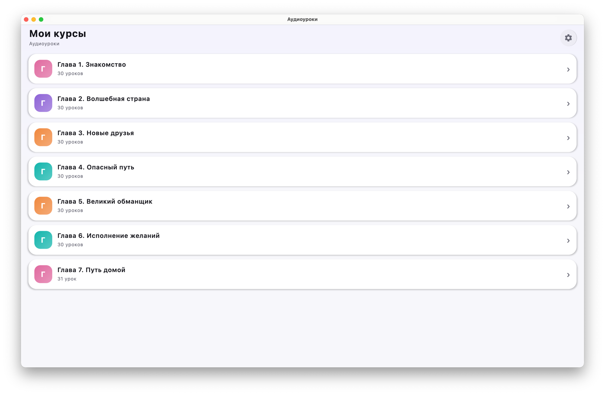
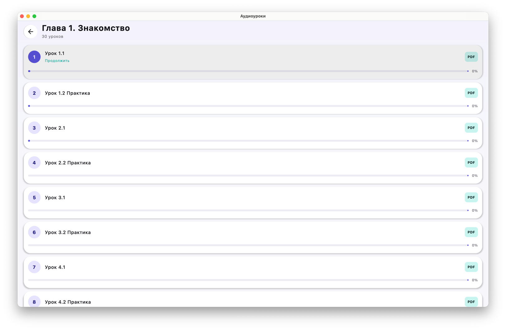
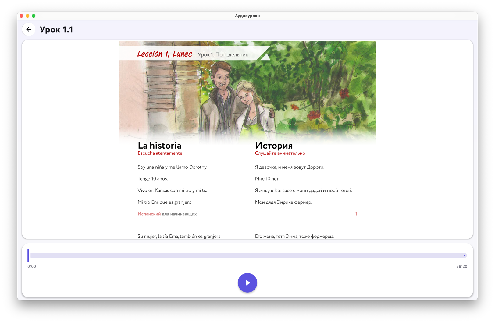

# Аудиоуроки · MP-LessonViewer

Кроссплатформенное приложение на **Kotlin Multiplatform + Compose Multiplatform** для прослушивания аудиоуроков с синхронным просмотром текстовой версии (PDF).

Вы складываете курсы в папку, выбираете её в приложении — и получаете список курсов → уроков → плеер с текстом. Прогресс по каждому уроку сохраняется, аудио играет в фоне.

**Платформы:** Android · iOS · Desktop (macOS / Windows / Linux)

## Возможности

- 📂 Выбор папки с курсами системным пикером (доступ сохраняется между запусками)
- 🎧 Фоновое воспроизведение аудио (media3 на Android, AVPlayer на iOS, JavaFX на Desktop)
- 📄 Просмотр PDF-версии урока рядом с плеером
- 🔢 Автоматическая привязка PDF к аудио по номеру урока (`Урок 1.1.mp3` ↔ `Урок 1. Текст.pdf`)
- 📊 Прогресс прослушивания на каждой карточке урока + продолжение с последнего урока
- 🌗 Светлая / тёмная / системная тема

## Структура папок с курсами

Приложение рекурсивно сканирует выбранную папку:

```
Папка с курсами/
└── Курс/                      ← напр. «Испанский для начинающих»
    └── Глава 1. Знакомство/   ← опциональные подпапки-главы
        ├── Урок 1. Текст.pdf  ← текст для урока 1
        ├── Урок 1.1.mp3       ← аудио
        └── Урок 1.2 Практика.mp3
```

## Скриншоты

| Курсы | Уроки | Плеер + PDF |
|---|---|---|
|  |  |  |

## Запуск

**Desktop:**
```bash
./gradlew :desktopApp:run
```

**Android** (на подключённое устройство/эмулятор):
```bash
./gradlew :androidApp:installDebug
```

**iOS:** открыть `iosApp/iosApp.xcodeproj` в Xcode и запустить, либо через KMP-плагин Android Studio.

### Сборка дистрибутивов

```bash
./gradlew :androidApp:assembleRelease     # Android APK/AAB
./gradlew :desktopApp:packageDmg          # macOS .dmg (или packageMsi / packageDeb)
```

## Технологии

Kotlin Multiplatform · Compose Multiplatform · Koin (DI) · Navigation Compose ·
[FileKit](https://github.com/vinceglb/FileKit) (доступ к файлам) · media3 · AVFoundation · JavaFX · PDFBox · PdfRenderer · PDFKit · Multiplatform Settings

Архитектура — **MVI**: на каждый экран триада `State / Action / Event` и `ViewModel` с `onAction()`.
